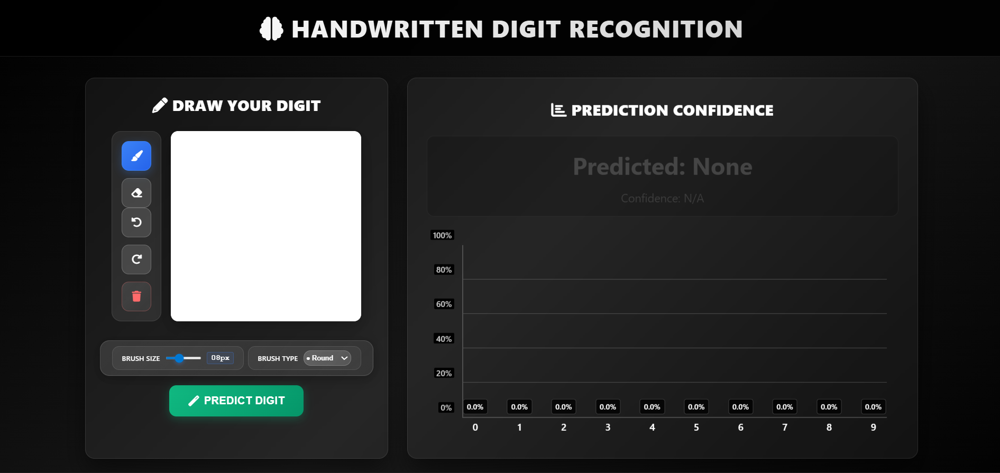

# 🔢 Handwritten Digit Recognition

<a href="https://github.com/Rishabh-Baloni/handwritten-digit-recognition"></a>

A modern web application that recognizes handwritten digits (0-9) using a trained neural network model. Draw digits on an interactive HTML5 canvas and get instant AI predictions with confidence scores!


## 🚀 Features

- **Interactive HTML5 Canvas**: Draw digits directly in your browser with mouse or touch
- **Real-time Predictions**: Get instant predictions with confidence scores
- **High Accuracy**: Uses a trained CNN model for accurate digit recognition
- **Modern Web Interface**: Beautiful, responsive design that works on all devices
- **Confidence Visualization**: See prediction confidence with charts and progress bars
- **Touch Support**: Works perfectly on tablets and mobile devices

## 📁 Project Structure

```
handwritten-digit-recognition/
├── app.py              # Flask web application
├── templates/
│   └── index.html      # Modern web interface
├── my_model.keras      # Trained neural network model
├── notebooks/          # Jupyter notebooks for training & analysis
│   └── README.md       # Notebook documentation
├── requirements.txt    # Python dependencies
├── README.md          # Project documentation
├── run.bat            # Windows run script
└── run.sh             # Linux/Mac run script
```

## 🛠️ Installation & Setup

### Prerequisites
- Python 3.8 or higher
- No additional packages needed (everything installs in virtual environment)

### Quick Start (Recommended)

#### Windows Users:
1. **Clone the repository**
   ```bash
   git clone https://github.com/Rishabh-Baloni/handwritten-digit-recognition.git
   cd handwritten-digit-recognition
   ```

2. **One-click setup and run**
   ```batch
   run.bat
   ```
   This will:
   - Create a virtual environment (venv folder)
   - Install all dependencies in the virtual environment
   - Start the application
   This will:
   - Create a virtual environment (venv folder)
   - Install all dependencies in the virtual environment
   - Start the Flask application
   - **Nothing gets installed globally on your system!**

#### Linux/Mac Users:
1. **Clone the repository**
   ```bash
   git clone https://github.com/Rishabh-Baloni/handwritten-digit-recognition.git
   cd handwritten-digit-recognition
   ```

2. **Make script executable and run**
   ```bash
   chmod +x run.sh
   ./run.sh
   ```

### Manual Setup (Alternative)

If you prefer manual setup:

1. **Create virtual environment**
   ```bash
   python -m venv venv
   ```

2. **Activate virtual environment**
   - Windows: `venv\Scripts\activate`
   - Linux/Mac: `source venv/bin/activate`

3. **Install dependencies**
   ```bash
   pip install -r requirements.txt
   ```

4. **Run the application**
   ```bash
   python app.py
   ```

5. **Open your browser**
   The app will be available at `http://localhost:5000`

### 🔒 Virtual Environment Benefits
- **Isolated Environment**: All packages install in the `venv` folder
- **No System Pollution**: Your global Python remains untouched
- **Easy Cleanup**: Just delete the `venv` folder to remove everything
- **Consistent Dependencies**: Everyone gets the exact same package versions

## 🎯 How to Use

1. **Draw a Digit**: Use your mouse to draw a digit (0-9) on the white canvas
2. **Get Prediction**: The model will automatically predict the digit you drew
3. **Check Confidence**: See how confident the model is about its prediction
4. **Clear & Retry**: Click "Clear Canvas" to draw a new digit

### Tips for Better Predictions
- Draw digits clearly and boldly
- Center the digit in the canvas
- Make the digit fill most of the drawing area
- Use continuous strokes when possible

## 📊 Dataset Information

### MNIST Handwritten Digits Dataset

This project uses the **MNIST dataset** for training and testing the digit recognition model.

#### Dataset Details:
- **Total Samples**: 70,000 handwritten digit images
- **Training Set**: 60,000 images
- **Test Set**: 10,000 images
- **Image Format**: 28x28 pixels, grayscale
- **Classes**: 10 digits (0-9)
- **File Size**: ~50-60 MB (compressed)

#### How to Get the Dataset:

**Option 1: Automatic Download (Recommended)**
```python
import tensorflow as tf

# Automatically downloads and loads MNIST
(x_train, y_train), (x_test, y_test) = tf.keras.datasets.mnist.load_data()
```

**Option 2: Manual Download**
- **Official Source**: http://yann.lecun.com/exdb/mnist/
- **Kaggle**: https://www.kaggle.com/datasets/hojjatk/mnist-dataset
- **Alternative**: https://github.com/zalandoresearch/fashion-mnist (Fashion-MNIST variant)

#### Dataset Files Structure:
```
MNIST Dataset:
├── train-images-idx3-ubyte  # Training images (60,000)
├── train-labels-idx1-ubyte  # Training labels (60,000)
├── t10k-images-idx3-ubyte   # Test images (10,000)
└── t10k-labels-idx1-ubyte   # Test labels (10,000)
```

**Note**: The dataset is not included in this repository due to GitHub file size limitations. The training notebooks automatically handle dataset downloading and preprocessing.

## 🧠 Model Information

- **Architecture**: Convolutional Neural Network (CNN)
- **Training Dataset**: MNIST handwritten digits (60,000 training samples)
- **Input Size**: 28x28 grayscale images
- **Output**: 10 classes (digits 0-9)
- **Performance**: High accuracy on handwritten digit recognition
- **Training Code**: Available in `notebooks/` folder

### Model Training

The model was trained using Jupyter notebooks located in the `notebooks/` folder. The training process includes:

1. **Data Download**: Automatic MNIST dataset download via `tf.keras.datasets.mnist.load_data()`
2. **Data Preprocessing**: Normalization and reshaping for CNN input
3. **Model Architecture**: CNN with convolutional, pooling, and dense layers
4. **Training**: Adam optimizer with categorical crossentropy loss
5. **Validation**: Performance evaluation on separate test set
6. **Model Export**: Saving trained model as `my_model.keras`

To retrain the model or explore the training process, check the Jupyter notebooks in the `notebooks/` directory.

## 🔧 Technical Details

### Dependencies
- **Flask**: Web framework for the backend API
- **TensorFlow**: Machine learning framework for model inference
- **NumPy**: Numerical computing for image processing
- **Pillow**: Image processing library
- **HTML5 Canvas**: Interactive drawing interface

### Image Processing Pipeline
1. Capture drawing from canvas
2. Convert to grayscale
3. Invert colors (black background, white digit)
4. Resize to 28x28 pixels
5. Normalize pixel values (0-1 range)
6. Add batch dimension for model input

## 🚀 Deployment Options

This app can be easily deployed on various platforms:

- **Streamlit Cloud**: Connect your GitHub repo for free hosting
- **Heroku**: Deploy with a simple `Procfile`
- **Railway**: One-click deployment from GitHub
- **Local Network**: Run locally and share IP address

## 🤝 Contributing

Contributions are welcome! Here are some ways you can contribute:

- Report bugs or issues
- Suggest new features
- Improve documentation
- Optimize model performance
- Enhance user interface

## 📄 License

This project is open source and available under the [MIT License](LICENSE).

## 🙋‍♂️ Support

If you encounter any issues or have questions:

1. **Check the documentation** - Review the setup instructions and troubleshooting tips above
2. **Verify your environment** - Ensure Python 3.8+ and all dependencies are properly installed
3. **Common solutions** - Try recreating the virtual environment or reinstalling requirements
4. **Contact the developer** - Reach out via the repository for technical assistance

## ⭐ Acknowledgments

- MNIST dataset for training data
- TensorFlow team for the machine learning framework
- Streamlit team for the amazing web framework
- Open source community for various tools and libraries

---

**Happy digit recognition! 🎉**
